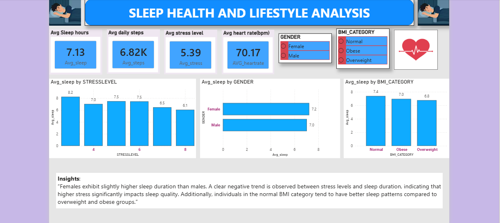
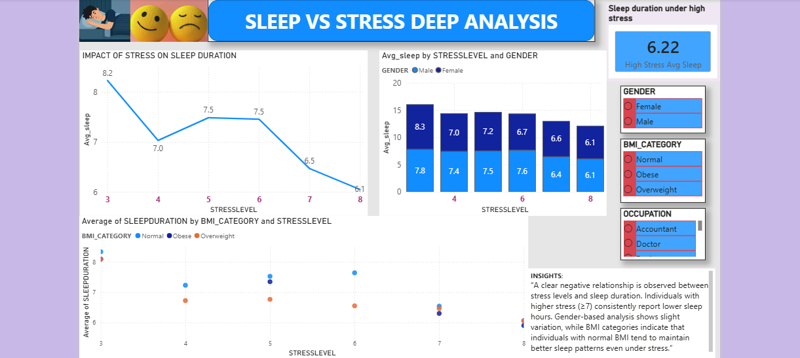
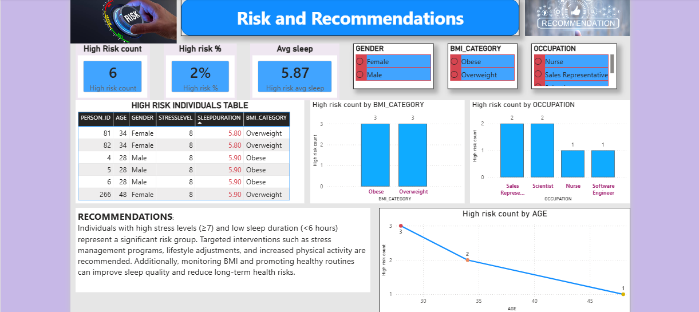

# 💤 Sleep Health & Lifestyle Analysis

## 📌 Problem Statement
Analyze how stress, lifestyle, and BMI impact sleep quality and identify high-risk individuals.

---

## 🛠 Tools Used
- Oracle SQL
- Power BI

---

## 🔄 Process
- Imported dataset into Oracle
- Cleaned and transformed data using SQL views
- Created analytical views for stress, activity, BMI, and risk
- Connected Oracle to Power BI using SQL queries
- Built interactive dashboards

---

## 📊 Dashboard Pages

### 🔹 Overview

### 🔹 Deep Analysis

### 🔹 Risk & Recommendations

---

## 🔍 Key Insights
- Higher stress levels lead to reduced sleep duration
- Normal BMI individuals tend to have better sleep patterns
- High-risk individuals identified with stress ≥7 and sleep <6 hours

---

## 💡 Recommendations
- Implement stress management strategies
- Encourage healthy lifestyle and physical activity
- Monitor high-risk individuals for long-term health improvement

---

## 📂 Project Files
- Power BI dashboard (.pbix)
- SQL scripts for data transformation
